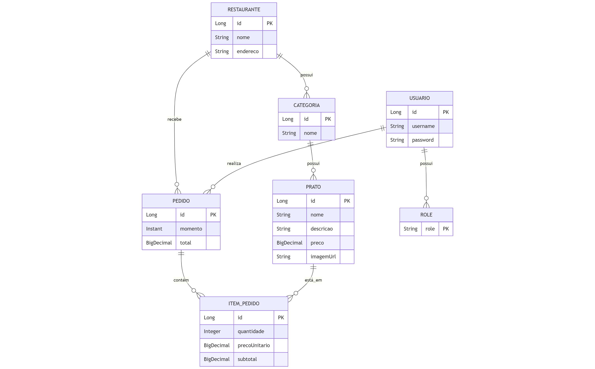

# 🍽️ Cardápio Digital

Sistema de gerenciamento de pedidos para restaurantes. O projeto permite o cadastro de restaurantes, categorias de pratos, pratos, pedidos e usuários com autenticação.

---

## 🚀 Tecnologias Utilizadas

- **Java 21**
- **Spring Boot 3.5**
- **Spring Data JPA**
- **Spring Security**
- **Hibernate**
- **Lombok**
- **H2 Database** (para testes)
- **MySQL** (ambiente principal)
- **DTOs e ResponseEntity**
- **Tratamento de exceções personalizadas**
- **Testes de Integração**
- **HATEOAS**
- **Modelo de Maturidade de Richardson**

---

## 🧠 Funcionalidades

- Autenticação com Spring Security
- Cadastro de usuários e definição de roles
- CRUD de restaurantes, categorias e pratos
- Criação e listagem de pedidos
- Relacionamentos entre entidades com JPA
- Validações e exceções personalizadas
- Camadas bem definidas: `controller`, `service`, `repository`, `dto`, `model`

---

## 📝 Diagrama

## 💡 Modelo de Maturidade de Richardson

Este projeto atende ao **nível 3** do modelo de maturidade de Richardson com:
- URIs bem definidas
- Uso adequado de métodos HTTP
- HATEOAS implementado

---
## 👨‍💻 Autor
**Victor da Costa Almada**

Apaixonado por tecnologia, estudante de **Análise e Desenvolvimento de Sistemas**, com foco em desenvolvimento backend com Java.
